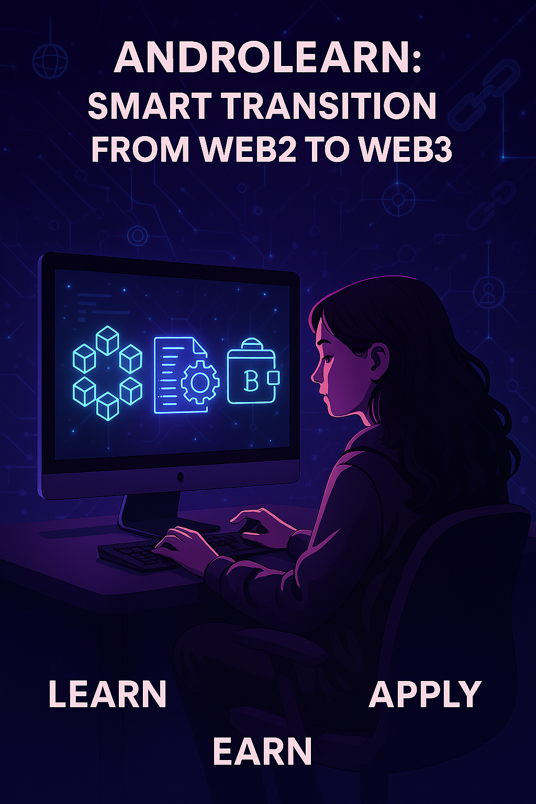

---

# 🧠 AndroLearn

AndroLearn, developed within the scope of the Andromeda Bootcamp, is a Learn-to-Earn platform designed to gradually onboard Web2 developers into the world of Web3. Users gain theoretical knowledge and earn digital rewards by completing on-chain tasks.

---

## 🌌 About Me

Hi, I'm Elif Koyuncu. I'm studying Management Information Systems at Gümüşhane University. My interest in Web3 technologies led me to participate in the Andromeda Bootcamp.

Through this project, my goal is to ease the transition for those with a Web2 background—just like myself—into Web3, helping them experience this world through practical tasks.

AndroLearn reflects this journey: it aims to support beginners, encourage them to learn and create, and make on-chain experience accessible to all.

---

## 📘 Project Details

AndroLearn is a platform where users learn fundamental Web3 topics and earn rewards like NFTs or tokens by putting that knowledge into practice on-chain.

**Core Topics Covered:**
- Creating and connecting wallets (Keplr / Hiro Wallet)
- First interaction with a smart contract
- Sending / receiving tokens
- Experiencing NFT minting and collecting

The app offers users an educational roadmap while presenting each task as a "level," helping them become more familiar with Web3 step by step.

✅ **Simple Flow:** Learn → Complete Tasks → Earn Rewards (on-chain experience)

---

## 🌍 Vision

Web3 can appear complex and intimidating to newcomers due to technical jargon and sophisticated processes.  
AndroLearn exists to break down these barriers:

- It provides knowledge through clear, accessible content  
- Offers hands-on experience through simple tasks  
- Rewards user interactions with the blockchain  

Thus, it creates a system that not only teaches but also motivates active participation.

**Future goals for the platform:**
- Expand with more tasks and topics  
- Launch international access via Turkish and English language support  
- Introduce certified learning modules and user progress tracking features  

---

## 🚀 Features

- 📚 Web3 learning modules (wallets, smart contracts, dApps)
- ✅ Task-based progression with on-chain verification
- 🎁 NFT and token rewards (learn-to-earn)
- 🔗 Andromeda blockchain integration
- 🛡️ Final certification as an NFT
- 🌐 User-friendly and beginner-focused interface

---

## 🛠️ Tech Stack

| Layer       | Tech                        |
|-------------|-----------------------------|
| Frontend    | Next.js, Tailwind CSS       |
| Backend     | Node.js (for task logic)    |
| Blockchain  | Andromeda (Testnet)         |
| Contracts   | CosmWasm / Clarity          |
| Wallet      | Keplr / Hiro Wallet         |
| Storage     | IPFS (NFT metadata)         |

---

## 🧪 Smart Contract Modules

- `TaskManager`: Verifies task completion and tracks progress
- `RewardNFT`: Mints NFTs after completing specific tasks
- `AndroToken`: Optional reward token contract (ERC20-style)

---

## 🧭 User Flow

1. Connect wallet  
2. Start learning modules  
3. Complete a task (e.g., send transaction on testnet)  
4. Smart contract verifies the action  
5. Receive reward on-chain (NFT or token)  
6. Track progress and collect final certification

---

## 🔧 Installation (for devs)

```bash
git clone https://github.com/ElifKoyuncu1/Andromeda-Bootcamp.git
cd AndroLearn
yarn install
yarn dev
```

---

## 🔧 Deployment Note

For smart contracts:  
Use **CosmWasm** or **Clarinet** to deploy contracts on the **Andromeda testnet**.  
Make sure to configure the network endpoints and wallet connection properly.

---

## 📍 Project Status

This is a **bootcamp-stage MVP**.  
- ✅ Frontend is functional  
- ⚙️ Smart contract modules are currently under development  
- 🔜 Next step: Enabling live reward minting on testnet

---

## 🤝 Acknowledgements

Thanks to the **Rise In** team for providing a rich learning environment and strong community support.  
This project was built to support other learners like me who are taking their first steps into Web3.

